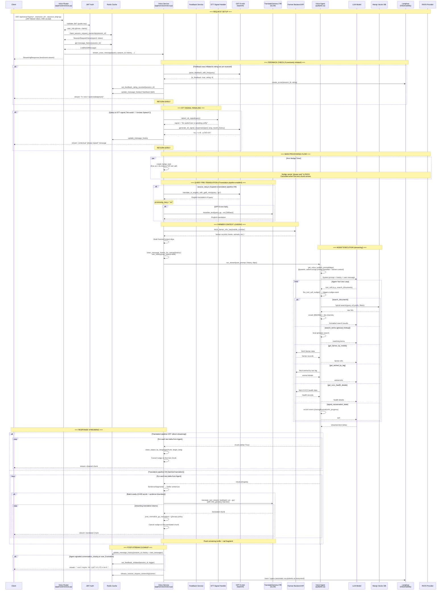

# Voice OAN API — Sequence Diagram

## Overview

This document describes the end-to-end request flow for the `voice-oan-api` service (branch: `amul-dev`), an AI-powered voice assistant API for agricultural support built with FastAPI and pydantic-ai.

## Sequence Diagram

## Key Architectural Points

### 3 Early-Exit Paths (before the main agent runs)

1. **Feedback collection** — if the previous turn asked for a rating, the user's reply is parsed by GPT-5-mini as feedback (1-5) rather than routed to the agent
2. **STT signal** — sentinel strings from the speech-to-text pipeline ("No audio", "Unclear Speech") trigger a short contextual "please repeat" via GPT-5-mini
3. **Stale request** — ownership checks throughout abort processing if a newer request has claimed the session

### Translation Pipeline (when enabled)

- **Input**: Gujarati query → GPT-5-mini pre-translates to English (fallback: TranslateGemma)
- **Agent runs in English** with English prompt template
- **Output**: English response → sentence-batched → TranslateGemma 27B streams back to Gujarati with glossary injection + term policy normalization

### Nudge Mechanism

A timer (default 1.5s) or tool-call event fires a "please wait" message to the RAYA provider, cancelled when the first real text/translated chunk reaches the client.

### Session Ownership

Redis-based epoch+token system ensures only the latest request for a session produces output — earlier in-flight requests self-abort.

### Agent Tools

| Tool | Purpose |
|------|---------|
| `search_documents` | Semantic/hybrid search over Marqo veterinary index with reranking |
| `search_terms` | Local glossary term lookup |
| `get_farmer_by_mobile` | Fetch farmer profile from backend API |
| `get_animal_by_tag` | Look up animal details by ear tag |
| `get_cvcc_health_details` | Fetch CVCC health records |
| `signal_conversation_state` | Signal closing/frustration/in_progress events for feedback triggers |
