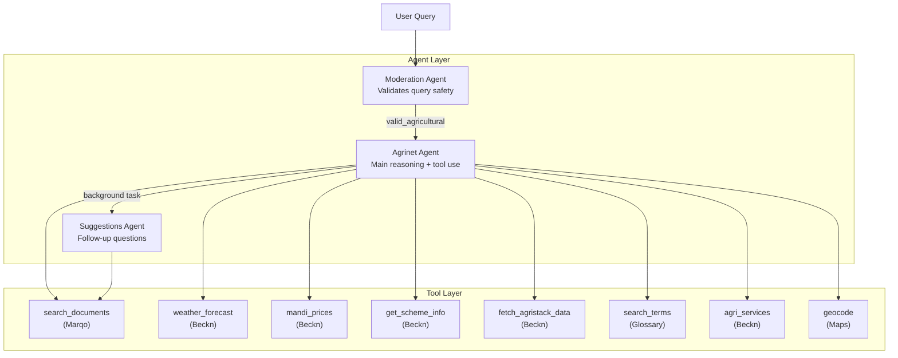
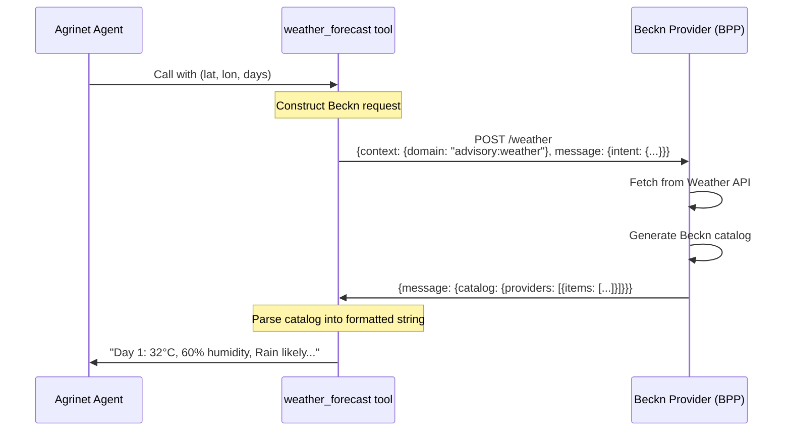
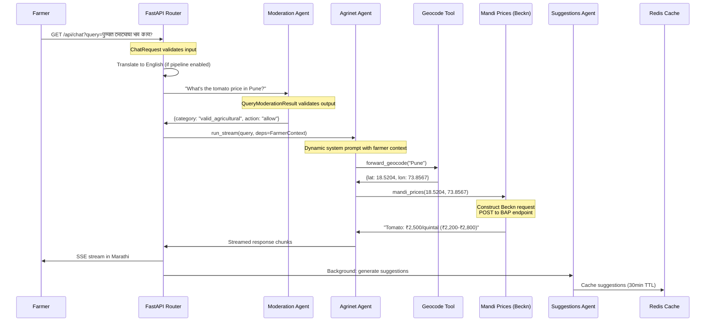
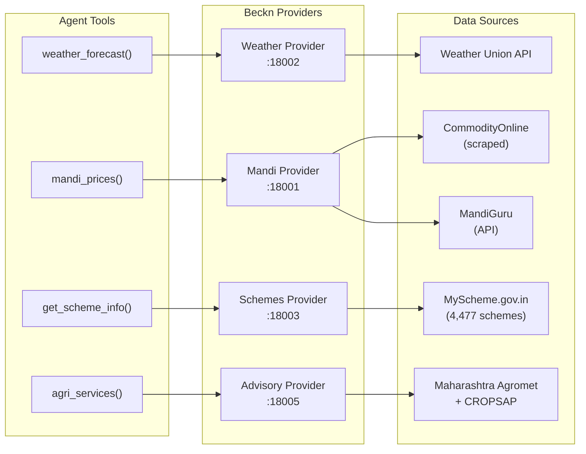

# Agentic Architecture: How pydantic-ai Powers OpenAgriNet

## Overview

OpenAgriNet uses [pydantic-ai](https://ai.pydantic.dev/) to build AI agents that connect farmers to agricultural information. The agents don't just answer questions — they **orchestrate tool calls** to fetch real-time data from Beckn providers, vector search engines, and government databases, then synthesize the results into contextual, multilingual responses.

This page explains how the agentic layer works end-to-end: from agent definitions and tool implementations, through Beckn protocol integration and document search, to streaming responses back to the user.

## Agent Architecture

Each deployment runs **three specialized agents**, each with a distinct role:



### 1. Moderation Agent — The Gatekeeper

Every query passes through moderation before reaching the main agent:

```python
class QueryModerationResult(BaseModel):
    category: Literal[
        "valid_agricultural",
        "invalid_language",
        "invalid_non_agricultural",
        "invalid_external_reference",
        "invalid_compound_mixed",
        "unsafe_illegal",
        "political_controversial",
        "cultural_sensitive",
        "role_obfuscation"
    ]
    action: str

moderation_agent = Agent(
    model=LLM_MODEL,
    name="Moderation Agent",
    output_type=QueryModerationResult,
    retries=2,
    model_settings=ModelSettings(
        temperature=0.1,      # Near-deterministic
        max_tokens=32,         # Just enough for the classification
        timeout=5
    )
)
```

The key design choices:

- **Structured output** via `output_type=QueryModerationResult` — the LLM must return a valid category from the Literal union. pydantic-ai validates this automatically.
- **Low temperature (0.1)** — moderation should be deterministic, not creative.
- **Minimal tokens (32)** — the agent only needs to produce a category and action, nothing more.
- **9 categories** with a bias toward permissiveness: "Be generous — default to `valid_agricultural` when unsure."

### 2. Agrinet Agent — The Reasoning Engine

The main agent that processes farmer queries, calls tools, and generates responses:

```python
agrinet_agent = Agent(
    model=LLM_MODEL,
    name="Vistaar Agent",
    output_type=str,
    deps_type=FarmerContext,
    retries=3,
    tools=TOOLS,
    end_strategy='exhaustive',
    model_settings=ModelSettings(
        max_tokens=8192,
        parallel_tool_calls=True,
        request_limit=50,
    )
)
```

Key design choices:

- **`deps_type=FarmerContext`** — typed dependency injection. The agent and all its tools receive the farmer's context (language, location, identity) as validated Pydantic data.
- **`end_strategy='exhaustive'`** — the agent keeps calling tools until it has enough information. It won't stop after one tool call if more data is needed.
- **`parallel_tool_calls=True`** — the agent can invoke multiple tools simultaneously (e.g., fetch weather AND market prices in one step).
- **`request_limit=50`** — safety cap to prevent runaway tool loops.

The system prompt is **dynamic**, injected at runtime with the current date and farmer context:

```python
@agrinet_agent.system_prompt(dynamic=True)
def get_agrinet_system_prompt(ctx: RunContext[FarmerContext]):
    farmer_context = ctx.deps.get_farmer_context_string()
    return get_prompt('agrinet_system', context={
        'today_date': get_today_date_str(),
        'farmer_context': farmer_context
    })
```

### 3. Suggestions Agent — Follow-up Questions

Runs as a **background task** after the main agent responds:

```python
suggestions_agent = Agent(
    model=LLM_MODEL,
    name="Suggestions Agent",
    output_type=List[str],
    result_tool_name="suggestions",
    tools=[Tool(search_documents, takes_ctx=False)],
    model_settings=ModelSettings(
        parallel_tool_calls=False,
    )
)
```

- **`output_type=List[str]`** — returns 3-5 follow-up questions as a validated list.
- Has access to `search_documents` so it can ground suggestions in available content.
- Results are cached in Redis (30-minute TTL) for quick retrieval.

## Dependency Injection: FarmerContext

The `FarmerContext` is the typed dependency that flows through the entire agent pipeline. Each deployment variant defines its own version:

```python
# MahaVistaar (mh-oan-api/agents/deps.py)
class FarmerContext(BaseModel):
    query: str
    lang_code: str = 'mr'                    # Marathi default
    moderation_str: Optional[str] = None
    farmer_id: Optional[str] = None          # From JWT token

    def get_user_message(self) -> str:
        """Combines query + language + moderation + agristack availability
        into a formatted prompt for the agent."""

    def get_farmer_context_string(self) -> Optional[str]:
        """Farmer details for system prompt personalization."""
```

```python
# AMUL OAN (amul-oan-api-check/agents/deps.py)
class FarmerContext(BaseModel):
    query: str
    lang_code: str = 'gu'                    # Gujarati default
    moderation_str: Optional[str] = None
    farmer_info: Optional[Dict[str, Any]] = None  # Full profile from JWT
```

Tools access the context via `RunContext`:

```python
@agrinet_agent.tool
async def fetch_agristack_data(ctx: RunContext[FarmerContext]) -> str:
    farmer_id = ctx.deps.farmer_id    # Type-safe access
    # ... fetch farmer profile from AgriStack
```

## Connecting to Beckn Providers

The agent's tools call Beckn provider endpoints using the standard Beckn request format. Each tool constructs a Beckn message with the appropriate `context.domain`, `action`, and `intent`, then parses the catalog response.

### How a Tool Call Becomes a Beckn Request



### Weather Forecast Tool (Beckn)

```python
async def weather_forecast(
    latitude: float,
    longitude: float,
    days: int = 5
) -> str:
    """Get weather forecast via Beckn protocol."""

    payload = {
        "context": {
            "domain": "advisory:weather:mh-vistaar",
            "action": "search",
            "bap_id": os.getenv("BAP_ID"),
            "bap_uri": os.getenv("BAP_URI"),
            "bpp_id": os.getenv("POCRA_BPP_ID"),
            "bpp_uri": os.getenv("POCRA_BPP_URI"),
        },
        "message": {
            "intent": {
                "category": {
                    "descriptor": {"name": "Weather-Forecast"}
                },
                "fulfillment": {
                    "stops": [{
                        "location": {"gps": f"{latitude},{longitude}"}
                    }]
                }
            }
        }
    }

    response = await httpx.post(
        os.getenv("BAP_ENDPOINT"), json=payload
    )

    # Parse Beckn catalog response
    catalog = response.json()
    items = catalog["message"]["catalog"]["providers"][0]["items"]

    # Format for the agent
    return format_weather_items(items)
```

The tool:
1. Constructs a Beckn-compliant request with context (domain, BAP/BPP identifiers) and intent (category, location)
2. POSTs to the BAP endpoint
3. Receives a Beckn catalog with weather items containing tags (temperature, humidity, rainfall, advisory)
4. Parses the response into Pydantic models and formats it as a readable string for the agent

### Market Prices Tool (Beckn)

```python
async def mandi_prices(
    latitude: float,
    longitude: float
) -> str:
    """Get APMC market prices via Beckn protocol."""

    payload = {
        "context": {
            "domain": "advisory:mh-vistaar",
            "action": "search",
        },
        "message": {
            "intent": {
                "category": {
                    "descriptor": {"code": "price-discovery"}
                },
                "fulfillment": {
                    "stops": [{
                        "location": {"gps": f"{latitude},{longitude}"}
                    }]
                }
            }
        }
    }

    # Returns catalog with items containing:
    # - price (min, max, estimated) in INR
    # - location (market name, district)
    # - time (relative: "1 day ago")
    # - source (CommodityOnline, MandiGuru)
```

### Government Schemes Tool (Beckn)

```python
async def get_scheme_info(scheme_code: str) -> str:
    """Fetch government scheme details via Beckn."""

    # Validates scheme_code against known list
    # Calls BAP_ENDPOINT with domain="advisory:mh-vistaar"
    # Returns: benefits, eligibility, application process, contacts
```

The schemes tool has a two-step workflow encoded in the system prompt:
1. **`get_scheme_codes()`** — returns a table of all available schemes
2. **`get_scheme_info(code)`** — fetches details for a specific scheme

State schemes are always presented before central schemes.

### AgriStack Tool (Beckn + PII Masking)

```python
async def fetch_agristack_data(
    ctx: RunContext[FarmerContext]
) -> str:
    """Fetch farmer profile from AgriStack via Beckn.

    Requires RunContext (takes_ctx=True) for farmer_id from JWT.
    Returns: masked PII (mobile, email, name) +
             unmasked farm data (plot area, village, district).
    """
```

This tool demonstrates context-aware Beckn calls:
- Uses `ctx.deps.farmer_id` from the JWT token
- Automatically masks PII in the response (e.g., `"7350994908"` → `"73***8"`)
- Returned data is used by the agent to personalize advice (land size, location, caste category for scheme eligibility)

### The Full Tool Registry

Each deployment registers its tools as a list:

```python
TOOLS = [
    Tool(search_terms, takes_ctx=False),          # Glossary fuzzy matching
    Tool(search_documents, takes_ctx=False),       # Marqo vector search
    Tool(search_videos, takes_ctx=False),           # Marqo video search
    Tool(reverse_geocode, takes_ctx=False),         # GPS → place name
    Tool(forward_geocode, takes_ctx=False),         # Place name → GPS
    Tool(weather_forecast, takes_ctx=False),        # Beckn weather
    Tool(weather_historical, takes_ctx=False),      # Beckn historical weather
    Tool(mandi_prices, takes_ctx=False),            # Beckn market prices
    Tool(agri_services, takes_ctx=False),           # Beckn KVK/CHC/warehouses
    Tool(fetch_agristack_data, takes_ctx=True),     # Beckn farmer profile
    Tool(get_scheme_codes, takes_ctx=False),         # Beckn scheme list
    Tool(get_scheme_info, takes_ctx=False),          # Beckn scheme details
    Tool(get_multiple_schemes_info, takes_ctx=False),# Beckn bulk schemes
    Tool(get_scheme_status, takes_ctx=True),         # Beckn MahaDBT status
    Tool(contact_agricultural_staff, takes_ctx=False),# Beckn staff contacts
]
```

Notice the `takes_ctx` flag: most tools only need their explicit parameters (latitude, longitude, query), but tools that need the farmer's identity (`fetch_agristack_data`, `get_scheme_status`) receive the full `RunContext[FarmerContext]`.

## Connecting to Document Search (Marqo)

The `search_documents` tool provides semantic search over agricultural knowledge bases:

```python
async def search_documents(
    query: str,
    top_k: int = 10,
) -> str:
    """Semantic search for documents using Marqo."""

    client = marqo.Client(url=os.getenv('MARQO_ENDPOINT_URL'))

    search_params = {
        "q": query,
        "limit": top_k,
        "filter_string": "type:document",
        "search_method": "hybrid",
        "hybrid_parameters": {
            "retrievalMethod": "disjunction",
            "rankingMethod": "rrf",      # Reciprocal Rank Fusion
            "alpha": 0.5,                 # 50% keyword + 50% semantic
            "rrfK": 60,
        },
    }

    results = client.index(index_name).search(**search_params)['hits']

    # Format as markdown for the agent
    formatted = []
    for hit in results:
        formatted.append(f"**{hit['name']}**\n{hit['text']}\n(Score: {hit['_score']:.2f})")
    return "\n---\n".join(formatted)
```

### Hybrid Search Strategy

The search uses **Reciprocal Rank Fusion (RRF)** to combine two retrieval methods:

- **BM25 keyword matching** — finds exact term matches (important for crop names, scheme codes)
- **Semantic embedding similarity** — finds conceptually related content (handles paraphrasing, multilingual queries)

The 50/50 alpha balance means both signals contribute equally. This works well for agricultural queries where farmers might use exact terminology ("PMFBY") or natural language ("crop insurance scheme").

### Document vs Video Search

```python
# Documents: hybrid search (keyword + semantic)
search_params = {
    "filter_string": "type:document",
    "search_method": "hybrid",
}

# Videos: pure semantic search (no keyword matching)
search_params = {
    "filter_string": "type:video",
    "search_method": "tensor",
}
```

Videos use pure semantic search because video titles and descriptions are less keyword-rich than document content.

### Glossary-Aware Search

Before searching documents, the agent uses `search_terms` to resolve agricultural terminology:

```python
async def search_terms(
    term: str,
    max_results: int = 5,
    threshold: float = 0.7,
) -> str:
    """Fuzzy match agricultural terms across languages.

    Uses rapidfuzz for similarity matching.
    Supports: English, Marathi (Devanagari), Transliteration.
    Returns: "Term → Marathi (transliteration) [95%]"
    """
```

This handles the common case where a farmer types a transliterated term (e.g., "pashu" for the Marathi word for livestock). The glossary tool resolves it to the canonical term, which then produces better document search results.

## End-to-End Request Flow

Here's what happens when a farmer asks "What's the tomato price in Pune?" in Marathi:



### The Streaming Pipeline

The chat service implements three streaming strategies:

**Basic streaming** — Collect full English response, translate, stream:
```python
async with agrinet_agent.run_stream(
    user_prompt=user_message,
    message_history=trimmed_history,
    deps=deps,
) as response_stream:
    async for chunk in response_stream.stream_text(delta=True):
        yield format_sse(chunk)
```

**Sentence-by-sentence** — Detect sentence boundaries, translate each sentence, stream immediately:
```python
# Detects sentence boundaries in the English stream
# Translates each complete sentence
# Streams the translation before the next sentence finishes
```

**Optimized batching** — Smart 60-120 word batches with abbreviation-aware segmentation:
```python
# Uses SimulStreaming segmenter for accurate sentence detection
# Handles decimals, abbreviations without false splits
# Batches for optimal translation quality vs latency
```

### SSE Format

Responses use OpenAI-compatible Server-Sent Events:

```python
def format_sse(content: str) -> str:
    event = {"choices": [{"delta": {"content": content}}]}
    return f"data: {json.dumps(event)}\n\n"
```

## How Beckn Providers Work

Each Beckn provider is an independent microservice that implements the standard request/response format:



Each provider:
1. **Receives** a Beckn request with `context` (domain, action) and `message.intent` (category, location, filters)
2. **Fetches** from its data source (API, scraped data, database)
3. **Transforms** into a Beckn catalog: `{providers: [{items: [{descriptor, price, location, tags}]}]}`
4. **Returns** the catalog to the calling tool

The agent tools parse the catalog response and format it as readable text that the LLM can incorporate into its answer.

### Catalog Structure

Every provider returns the same Beckn catalog shape:

```json
{
  "context": {"domain": "agriculture", "action": "on_search"},
  "message": {
    "catalog": {
      "descriptor": {"name": "Weather Forecast"},
      "providers": [{
        "id": "weather-provider",
        "descriptor": {"name": "Agricultural Weather Service"},
        "items": [
          {
            "id": "forecast-day-1",
            "descriptor": {"name": "Partly Cloudy"},
            "time": {"timestamp": "2026-03-18"},
            "tags": [
              {"code": "temp_max", "value": "32"},
              {"code": "humidity", "value": "65"},
              {"code": "rain_chance", "value": "40"},
              {"code": "advisory", "value": "Good time for fertilizer application"}
            ]
          }
        ]
      }]
    }
  }
}
```

This standardized format means the agent tools can parse any provider's response with the same logic — extract `providers[0].items`, iterate over tags, and format for the LLM.

## Variant Differences in Agent Configuration

While all deployments share the same architectural pattern, each configures its agents differently:

| Aspect | MahaVistaar | Bharat OAN | AMUL OAN |
|--------|------------|-----------|----------|
| **Agent name** | "Vistaar Agent" | "Vistaar Agent" | "Amul Vistaar Agent" |
| **max_tokens** | 8,192 | 10,240 | 4,000 |
| **retries** | 3 | 3 | 5 |
| **request_limit** | 50 | — | 10 |
| **System prompt** | Static date injection | **Multi-language** (loads `agrinet_{lang_code}`) | Includes **farmer profile** from JWT |
| **Streaming** | Sentence-by-sentence | **Node-based** (`agent.iter()`) | Basic |
| **Tools** | Full 15-tool registry | Similar to MahaVistaar | Primarily `search_documents` |

### Bharat OAN's Node-Based Streaming

Bharat OAN uses `agent.iter()` instead of `run_stream()` for finer control:

```python
async with agrinet_agent.iter(
    user_prompt=user_message,
    message_history=trimmed_history,
    deps=deps
) as agent_run:
    async for node in agent_run:
        if Agent.is_model_request_node(node):
            async with node.stream(agent_run.ctx) as response_stream:
                async for event in response_stream:
                    if isinstance(event, PartDeltaEvent):
                        if isinstance(event.delta, TextPartDelta):
                            if final_result_found:
                                yield event.delta.content_delta
                    elif isinstance(event, FinalResultEvent):
                        final_result_found = True
```

This approach:
- Filters out **thinking/reasoning tokens** from the user stream
- Distinguishes between intermediate tool-calling steps and the final response
- Only streams text after `FinalResultEvent` is received

## System Prompt Design

The system prompts encode agricultural domain expertise and tool-use workflows. Key sections:

### Mandatory Tool Use

The agent is instructed to **never answer from memory** — every factual claim must come from a tool:

> "You MUST use tools to answer questions. Do not rely on your training data for agricultural information. Always use search_documents, weather_forecast, or other tools to get current, verified data."

### Term Resolution Workflow

Before searching documents, the agent follows a structured process:

1. Extract key agricultural terms from the query
2. Call `search_terms()` to resolve transliterated or ambiguous terms
3. Use the resolved terms in `search_documents()`

This prevents the common failure mode where a transliterated Marathi word produces zero search results because the index uses Devanagari script.

### Scheme Discovery Workflow

Government schemes follow a strict ordering:

1. Call `get_scheme_codes()` to list all available schemes
2. Categorize: **state schemes first**, then central schemes
3. Call `get_scheme_info()` for each, presenting state before central
4. Include eligibility criteria and application process

### Language Rules

- **Tool calls**: Always in English (tools expect English queries)
- **Responses**: Always in the farmer's selected language
- **Marathi responses**: 100% Marathi — no English terms except measurement units
- **English responses**: Simple vocabulary, farmer-friendly

## Key Architectural Insights

**1. Tools are the agent's interface to the world.** The LLM never calls APIs directly. Every external interaction goes through a validated tool function with typed parameters and structured return values.

**2. Beckn is the data interchange format, not a runtime dependency.** Agent tools construct Beckn requests and parse Beckn responses, but the agent itself doesn't know about the Beckn protocol. It just calls `weather_forecast(lat, lon)` and gets back formatted text.

**3. The same agent pattern scales from simple search to complex orchestration.** The AMUL OAN agent has one tool (`search_documents`). The MahaVistaar agent has 15 tools spanning weather, markets, schemes, and farmer profiles. Same `Agent()` definition, different tool registries.

**4. Validation is continuous.** Pydantic validates at every boundary: API input → FarmerContext → tool parameters → tool responses → agent output → API response. No unvalidated data passes between components.

**5. Streaming is a first-class concern.** The architecture supports three streaming strategies (basic, sentence-by-sentence, optimized batching) because agricultural advisory is often voice-first — latency matters when a farmer is listening to a spoken response.
