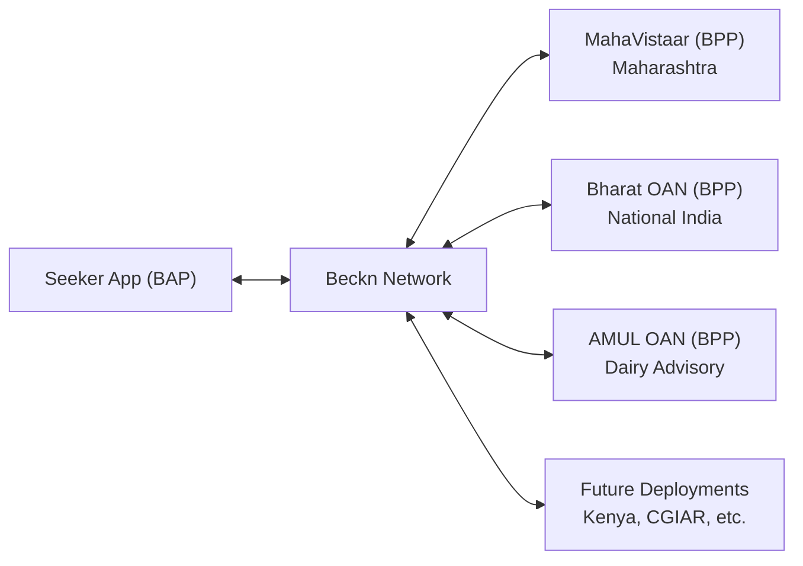
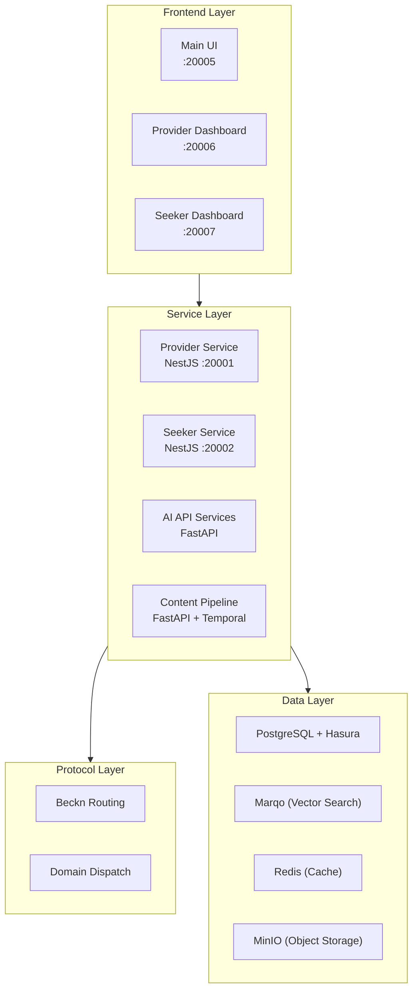

# OpenAgriNet Architecture

## The Problem

Agricultural information is fragmented across disconnected systems worldwide. A farmer looking for market prices uses one platform, weather forecasts come from another, government schemes live in a third, and pest advisories in a fourth. These systems don't talk to each other, are sector-centric rather than farmer-centric, and rarely support the local languages farmers actually speak.

This fragmentation exists at every scale — between districts, states, countries, and organizations. A scheme database in Maharashtra doesn't interoperate with one in Kenya. A market price API built for one state can't be discovered by an app built for another.

**OpenAgriNet** is a global coalition of 40+ organizations across 5 continents working to fix this. The approach combines **Digital Public Infrastructure (DPI)** — open protocols and shared standards — with **AI** to create an interconnected, interoperable agricultural information network.

Learn more at [openagrinet.global](https://openagrinet.global/).

## The Protocol Choice: Beckn & Open Networks

The core architectural decision in OpenAgriNet is the adoption of the **Beckn protocol** — an open, decentralized protocol that enables any service provider to be discoverable by any consumer application, without bilateral integration.

### How Beckn Works

Beckn defines two roles:

- **BAP (Beckn Application Platform)** — the consumer/seeker side. An app that farmers use to search for information.
- **BPP (Beckn Provider Platform)** — the provider side. A service that offers agricultural data (market prices, weather, schemes, advisories).

BAPs and BPPs communicate through the Beckn network using a standard lifecycle:

**search** → **select** → **init** → **confirm**

A seeker app doesn't need to know about every provider. It broadcasts a search to the network, and any relevant provider can respond.

### DSEP: Discovery for Agriculture

OpenAgriNet uses **DSEP (Distributed Search & Enquiry Protocol)**, a Beckn specification designed specifically for discovery and enquiry use cases — not just commerce. This fits agriculture perfectly: farmers are primarily discovering information (weather forecasts, scheme eligibility, market prices), not placing orders.

### The Network Effect

The power of this architecture is that independent deployments connect through the shared protocol:



Each deployment is built independently, serves its own geography or organization, and becomes discoverable to the entire network by registering as a BPP.

## System Architecture

The platform is organized in four layers:



### Protocol Layer

Beckn message routing with **domain-based dispatch**. The `context.domain` field in each request determines which service handles it:

- `weather-advisory:oan` → Weather provider
- `schemes:oan` → Government schemes provider
- `mandi:oan` → Market prices provider

### Service Layer

| Service | Port | Type | Purpose |
|---------|------|------|---------|
| Provider Service | 20001 | NestJS | Manages provider catalogs, items, categories via TypeORM |
| Seeker Service | 20002 | NestJS | Middleware for protocol transactions, caching, scheduling |
| OAN AI API | 20003 | FastAPI | LLM-based chat, transcription, suggestions, TTS |
| Bharat OAN API | 20004 | FastAPI | National-level scheme integration |
| MahaVistaar OAN API | 20008 | FastAPI | Maharashtra-specific AI services |
| AMUL OAN API | — | FastAPI | Dairy & veterinary advisory |
| AMUL Pipeline | 8001 | FastAPI + Temporal | Document OCR, translation, vector ingestion |
| Main UI | 20005 | React/Vite | Primary user interface |
| Provider UI | 20006 | React/Vite | Provider management dashboard |
| Seeker UI | 20007 | React/Vite | Seeker interaction dashboard |

### Data Layer

- **PostgreSQL + Hasura** — Structured data with a GraphQL API layer. Hasura provides real-time subscriptions and fine-grained row-level permissions.
- **Marqo** — Vector search engine for semantic retrieval. Powers natural-language search across agricultural content.
- **Redis** — Session cache and suggestions cache. Keeps frequently-accessed data fast.
- **MinIO** — S3-compatible object storage for documents, PDFs, and media files.

### Frontend Layer

Three React/Vite applications: a main user-facing UI, a provider management dashboard, and a seeker interaction dashboard.

## The Model Layer: Pydantic at the Core

Every AI API service in OpenAgriNet uses **Pydantic** models as the source of truth for data contracts. A representative example:

```python
class ChatRequest(BaseModel):
    query: str = Field(..., description="User's chat query")
    session_id: Optional[str] = Field(None, description="Session identifier")
    source_lang: str = Field('mr', description="Source language code")
    target_lang: str = Field('mr', description="Target language code")
    user_id: str = Field('anonymous', description="User identifier")
```

This single model definition:
- **Validates** every incoming request (invalid data fails fast)
- **Documents** the API (Field descriptions generate OpenAPI specs automatically)
- **Configures** deployment behavior (language defaults vary by region)

Pydantic's role extends beyond API validation. Through **pydantic-ai**, the same model patterns structure LLM agent reasoning — tool parameters, agent outputs, and dependency injection contexts are all schema-validated.

::: tip Deep Dive
For the full model hierarchy, code examples, and end-to-end flow trace, see the [Pydantic Models Deep Dive](./pydantic-models).
:::

## Architecture Flexibility

### 1. Regional & Organizational Variants

MahaVistaar (Maharashtra state), Bharat OAN (national India), and AMUL OAN (dairy cooperative) are independent deployments built from the same architectural patterns. Each customizes:

- **Language defaults** — Hindi, Marathi, or Gujarati depending on the target population
- **Domain-specific agent tools** — government scheme lookup, market prices, veterinary search
- **Data sources and APIs** — state-specific databases, national registries, organizational knowledge bases
- **Content moderation rules** — context-appropriate content filtering

They connect as independent BPPs on the Beckn network. See [Regional Variants](./variants) for the full comparison.

### 2. Swappable Service Backends

Pydantic `Literal` types make backend selection explicit in the API contract:

```python
service_type: Literal['bhashini', 'whisper'] = Field('bhashini')
```

This pattern applies to TTS (text-to-speech), STT (speech-to-text), and LLM providers. Adding a new backend means adding a value to the Literal union — the model itself documents what's available. [Bhashini](https://bhashini.gov.in/) is India's government translation platform; [Whisper](https://github.com/openai/whisper) is an open-source speech recognition model.

### 3. Content Pipeline as Architecture Pattern

The AMUL veterinary pipeline demonstrates that the same Pydantic-based approach extends beyond real-time APIs to **durable, multi-stage document processing**:

- PDF → OCR → Translation → Chunking → Vector Ingestion
- Human review gates at each stage
- Temporal workflows for durable execution

Same model patterns, different execution model.

### 4. Modular Beckn Providers

Each data source is an independent provider module:

| Provider | Data Source | Output |
|----------|-----------|--------|
| Schemes | MyScheme.gov.in (4,477+ schemes) | Scheme catalogs |
| Mandi | CommodityOnline, MandiGuru | Market price catalogs |
| Weather | Weather Union API | Weather forecast catalogs |
| Advisory | Agricultural universities | Farm advisory catalogs |
| Maps | Ola Maps SDK | Geocoding results |

Adding a new data source means adding a new provider + catalog generator — no changes to the core platform.

## Technology Stack

| Layer | Technology | Purpose |
|-------|-----------|---------|
| Protocol | Beckn / DSEP | Decentralized service discovery and interoperability |
| Backend (Services) | NestJS, TypeORM | Provider/Seeker catalog management, Beckn routing |
| Backend (AI) | FastAPI, pydantic-ai | LLM chat, voice, suggestions, content moderation |
| Backend (Pipeline) | FastAPI, Temporal | Durable document processing workflows |
| Data (Relational) | PostgreSQL, Hasura | Structured data, GraphQL API, real-time subscriptions |
| Data (Vector) | Marqo | Semantic search across agricultural content |
| Data (Cache) | Redis | Session state, suggestions, search cache |
| Data (Storage) | MinIO | S3-compatible document and media storage |
| Frontend | React, Vite, TypeScript | User interfaces and dashboards |
| Orchestration | Kubernetes (Kind), Tilt | Local development and deployment |

## Further Reading

- **[Glossary](./glossary)** — Definitions for agricultural, protocol, and platform-specific terms
- **[Pydantic Models Deep Dive](./pydantic-models)** — Full model hierarchy, code examples, and end-to-end request flow
- **[Regional & Organizational Variants](./variants)** — How MahaVistaar, Bharat OAN, and AMUL OAN adapt the architecture
