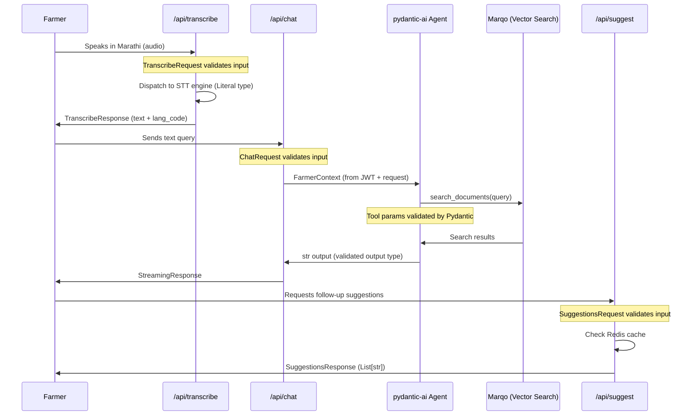

# Pydantic Models Deep Dive

## Why Pydantic

Pydantic serves four distinct roles across the OpenAgriNet platform:

**Validation at boundaries.** Every API request and response is validated against a Pydantic model. Invalid data fails fast with clear, structured error messages — no silent corruption propagating through the system.

**Self-documenting schemas.** `Field(description=...)` annotations generate OpenAPI documentation automatically. The models *are* the API specification. When a model changes, the docs update. There's no separate spec to keep in sync.

**LLM agent integration.** Through [pydantic-ai](https://ai.pydantic.dev/), the same Pydantic patterns that validate API inputs also structure LLM agent behavior — agent outputs, tool parameters, and dependency injection contexts are all schema-validated. The validation discipline extends from the API boundary into the AI reasoning loop.

**Pipeline state management.** The AMUL veterinary pipeline uses Pydantic models to track document state through multi-stage durable workflows with human review gates at each stage.

## Model Families

### Request Models — API Input Contracts

Every AI API endpoint accepts a Pydantic model that defines its contract:

```python
class ChatRequest(BaseModel):
    query: str = Field(..., description="User's chat query")
    session_id: Optional[str] = Field(None, description="Session identifier")
    source_lang: str = Field('mr', description="Source language code")
    target_lang: str = Field('mr', description="Target language code")
    user_id: str = Field('anonymous', description="User identifier")
```

Key patterns:

- **Language defaults vary by deployment.** The `source_lang` and `target_lang` fields default to `'hi'` (Hindi) in national deployments, `'mr'` (Marathi) in Maharashtra, and `'mr'`/`'gu'` (Gujarati) in AMUL. Same model structure, different configuration.
- **`session_id` is always Optional.** This supports both stateless usage (one-off queries) and stateful conversations (multi-turn chat with context).
- **`user_id` defaults to `'anonymous'`.** Graceful degradation — the system works without authentication, but can personalize when a user is identified.

### Response Models — Inheritance for Consistency

```python
class BaseResponse(BaseModel):
    status: str = Field(..., description="Response status")
    message: Optional[str] = Field(None, description="Response message")

class TranscribeResponse(BaseResponse):
    text: Optional[str] = Field(None)
    lang_code: Optional[str] = Field(None)
    session_id: Optional[str] = Field(None)
```

`BaseResponse` establishes a contract that every API response shares: a `status` field and an optional `message`. Specific responses like `TranscribeResponse` extend this with domain-specific fields. Consumers can always check `status` regardless of which endpoint they called.

### Service Selection via Literal Types

```python
class TranscribeRequest(BaseModel):
    audio_content: str = Field(..., description="Base64-encoded audio")
    service_type: Literal['bhashini', 'whisper'] = Field('bhashini')
    session_id: Optional[str] = Field(None)

class TTSRequest(BaseModel):
    text: str = Field(..., description="Text to convert to speech")
    target_lang: str = Field('mr', description="Target language")
    service_type: Literal['bhashini', 'eleven_labs'] = Field('bhashini')
    session_id: Optional[str] = Field(None)
```

`Literal` types make the set of available backends **explicit in the schema**. The model itself documents which implementations exist:

- [Bhashini](https://bhashini.gov.in/) — India's government-built translation and speech platform
- [Whisper](https://github.com/openai/whisper) — open-source speech recognition model

Adding a new backend means adding a value to the Literal union. The schema, validation, and OpenAPI docs all update automatically.

### Pipeline State Models

The AMUL veterinary pipeline uses Pydantic to manage complex document processing state:

```python
class DocumentStage(str, Enum):
    REGISTERED = "registered"
    OCR_PROCESSING = "ocr_processing"
    OCR_REVIEW = "ocr_review"
    TRANSLATION_PROCESSING = "translation_processing"
    TRANSLATION_REVIEW = "translation_review"
    CHUNKING = "chunking"
    CHUNK_REVIEW = "chunk_review"
    READY_FOR_INGESTION = "ready_for_ingestion"
    INGESTING = "ingesting"
    COMPLETED = "completed"
    FAILED = "failed"

class PageData(BaseModel):
    page_number: int
    original_markdown: str
    edited_markdown: Optional[str] = None
    is_reviewed: bool = False
    reviewer_notes: Optional[str] = None
    detected_language: Optional[str] = None
    translated_markdown: Optional[str] = None
    edited_translation: Optional[str] = None
    translation_reviewed: bool = False
    translation_notes: Optional[str] = None
```

The same Pydantic validation that handles a simple chat request also manages a multi-stage pipeline spanning days. `PageData` tracks both original and edited content at each stage, enabling human review without losing the original data.

### Agent Context Models (pydantic-ai)

Each deployment variant defines its own `FarmerContext` — the typed context injected into pydantic-ai agents:

```python
# AMUL OAN (amul-oan-api-check/agents/deps.py)
class FarmerContext(BaseModel):
    query: str
    lang_code: str = 'gu'          # Gujarati default
    moderation_str: Optional[str] = None
    farmer_info: Optional[Dict[str, Any]] = None

# MahaVistaar (mh-oan-api/agents/deps.py)
class FarmerContext(BaseModel):
    query: str
    lang_code: str = 'mr'          # Marathi default
    moderation_str: Optional[str] = None
    farmer_id: Optional[str] = None
```

Same pattern, different defaults and fields. The agent receives user-specific information (language preference, location, farm details from JWT) as validated, typed data — not raw dictionaries or string parsing.

## End-to-End Flow

A typical user interaction traces through multiple Pydantic validation boundaries:



Every arrow crossing a service boundary is a Pydantic validation point. Invalid data at any step produces a clear error rather than propagating silently through the system.

## pydantic-ai Integration

pydantic-ai extends Pydantic from API validation into LLM orchestration. The same model patterns apply:

### Agent Definition

```python
from pydantic_ai import Agent
from pydantic_ai.settings import ModelSettings

agrinet_agent = Agent(
    model=LLM_MODEL,
    output_type=str,
    retries=5,
    tools=[search_documents],
    model_settings=ModelSettings(
        max_tokens=4000,
        parallel_tool_calls=True
    )
)
```

- `output_type=str` — the agent's response is validated against this type
- `retries=5` — automatic retry with exponential backoff on validation failures
- `tools` — functions the agent can call, each with Pydantic-validated parameters

### Tool Definition

```python
@agrinet_agent.tool
async def search_documents(
    ctx: RunContext[FarmerContext],
    query: str
) -> str:
    """Search the agricultural knowledge base."""
    # ctx.deps gives typed access to FarmerContext
    # query is validated as str by pydantic-ai
    results = await marqo_search(query, top_k=10)
    return format_results(results)
```

The `RunContext[FarmerContext]` type parameter means:
- The agent receives the farmer's context (language, location, identity) as typed data
- Tool functions access this context via `ctx.deps`
- pydantic-ai validates both the tool's input parameters and its return value

### The Key Insight

pydantic-ai uses the same `BaseModel` patterns for:

- **Agent output types** — validated LLM responses (not raw text)
- **Tool parameters** — validated tool calls (the LLM can't pass malformed arguments)
- **Dependency injection** — typed agent state (farmer context, session data)

The validation discipline applied at API boundaries extends into the LLM reasoning loop. When an agent calls a tool, the arguments are schema-validated. When the agent produces a response, it's type-checked. This makes LLM integration as reliable as traditional API calls.

## Model Configuration Pattern

LLM provider selection is environment-driven across all deployments:

```python
LLM_PROVIDER = os.getenv('LLM_PROVIDER', 'default_provider')
LLM_MODEL_NAME = os.getenv('LLM_MODEL_NAME', 'default_model')
```

Each service's `agents/models.py` handles provider-specific initialization:

```python
if LLM_PROVIDER == 'provider_a':
    LLM_MODEL = SomeModel(model_name, provider=ProviderA(api_key=...))
elif LLM_PROVIDER == 'provider_b':
    LLM_MODEL = SomeModel(model_name, provider=ProviderB(base_url=...))
```

The rest of the codebase is provider-agnostic — agents, tools, and routers all reference `LLM_MODEL` without knowing which provider is behind it. Switching providers is a configuration change, not a code change.
