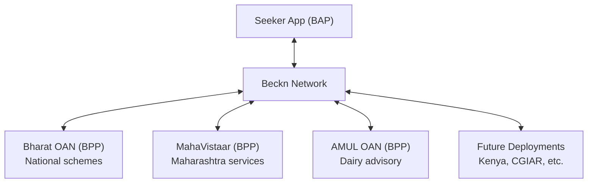

# Regional & Organizational Variants

## The Pattern

OpenAgriNet's architecture is designed so that the same patterns produce independent deployments tailored to different regions, organizations, and use cases. Each variant:

- Serves a specific geography or organization
- Customizes language defaults, domain tools, and data sources
- Can operate **independently** or connect to other variants through the Beckn network

This isn't configuration-driven theming — each variant is a fully independent service with its own agent tools, data sources, and deployment. The shared patterns (Pydantic models, pydantic-ai agents, FastAPI routers) provide consistency without coupling.

## Comparison

| Dimension | Bharat OAN | MahaVistaar | AMUL OAN | AMUL Pipeline |
|-----------|-----------|-------------|----------|---------------|
| **Scope** | National (India) | State (Maharashtra) | Organization (AMUL dairy cooperative) | Content ingestion |
| **Domain** | Government schemes | Maharashtra farming | Dairy & veterinary advisory | Veterinary textbook digitization |
| **Default language** | Hindi (hi) | Marathi (mr) | Marathi (mr) at API layer, Gujarati (gu) in agent context | Auto-detect (hi/gu/mr/en) |
| **LLM framework** | pydantic-ai | pydantic-ai | pydantic-ai | OCR-specific |
| **Domain tools** | Schemes, PMFBY | AgriStack, MahaDBT, staff contacts | Document search, glossary matching | OCR, translation, chunking |
| **Architecture** | Stateless API | Stateless API | Streaming + voice-first | Temporal durable workflows |
| **Unique pattern** | Scheme catalog generation | Content moderation | Farmer context from JWT, fuzzy Gujarati glossary | 4-stage human review gates |
| **Voice support** | Transcribe + TTS | Transcribe + TTS | Transcribe + TTS (primary interface) | None |

### Bharat OAN — National Scale

Focused on central government schemes (4,477+ schemes from MyScheme.gov.in) and PMFBY crop insurance. Hindi-first. Generates Beckn-compliant catalogs from national scheme databases so that any seeker app on the network can discover scheme eligibility for a farmer.

### MahaVistaar — State Depth

Maharashtra-specific services: AgriStack farmer data integration, MahaDBT scheme applications, agricultural staff contact lookup. Marathi-first. Includes content moderation tailored to the agricultural advisory context.

### AMUL OAN — Organizational Focus

Built for AMUL, India's largest dairy cooperative. Voice-first architecture — the primary interface is spoken Gujarati/Marathi, not text. Farmer identity from JWT tokens enables personalized advisory based on farm details. Fuzzy glossary matching handles transliterated agricultural terms (e.g., matching "pashu" to the Gujarati veterinary term).

### AMUL Pipeline — Content Ingestion

A different execution model entirely: **durable workflows** via [Temporal](https://temporal.io/) for processing veterinary textbooks:

1. **OCR** — PDF pages processed through OCR, returning structured markdown
2. **Translation** — Auto-detect language (Hindi, Gujarati, Marathi, English), translate to target language
3. **Chunking** — Split into token-sized chunks with page boundary tracking
4. **Vector Ingestion** — Index into Marqo with multilingual embeddings

Each stage has a **human review gate** — the workflow pauses until a reviewer approves the output. This is the same Pydantic validation pattern (models like `PageData`, `ChunkData`, `DocumentStage`) applied to a multi-day pipeline instead of a real-time API call.

## How They Connect

Each variant is an independent BPP (Beckn Provider Platform) on the open network. A seeker application can discover services from any of them through the Beckn protocol:



No bilateral integration needed. A new variant registers as a BPP and is immediately discoverable by every BAP on the network. A farmer in Maharashtra might get results from both MahaVistaar (state schemes) and Bharat OAN (national schemes) in a single search.

## Adding a New Variant

Standing up a new regional or organizational deployment follows a predictable path:

::: info Copy & Configure (Steps 1-2)
No framework code to write — these steps reuse existing patterns.
:::

**1. Fork the FastAPI service pattern.** Copy the model/router/agent structure from any existing variant. The directory layout is consistent:
```
new-variant/
├── app/
│   ├── models/          # Pydantic request/response models
│   │   ├── requests.py
│   │   └── responses.py
│   ├── routers/         # FastAPI endpoint handlers
│   │   ├── chat.py
│   │   ├── transcribe.py
│   │   ├── tts.py
│   │   └── suggestions.py
│   └── config.py        # Environment-driven settings
└── agents/
    ├── models.py        # LLM provider configuration
    ├── deps.py          # FarmerContext definition
    ├── agrinet.py       # Main agent definition
    └── tools/           # Domain-specific tool functions
```

**2. Configure language defaults.** Set `source_lang` and `target_lang` in request models to match the target population's primary language.

::: warning Domain Development (Step 3)
This is the only step that requires writing new code specific to your region/organization.
:::

**3. Add domain-specific tools.** Implement agent tool functions for local data sources. Examples:
- A Kenyan deployment might add tools for KALRO crop advisories and local market prices
- A CGIAR deployment might add tools for querying 50+ years of research data
- A state deployment might add tools for state-specific scheme databases

::: info Infrastructure Setup (Steps 4-6)
Standard deployment tasks — no OAN-specific code.
:::

**4. Set up vector search.** Create a Marqo index and ingest relevant agricultural content (advisories, scheme documents, crop guides).

**5. Configure environment.** Set LLM provider, cache endpoints, external API keys via environment variables.

**6. Register as BPP.** Connect to the Beckn network so your variant is discoverable by any seeker app.
